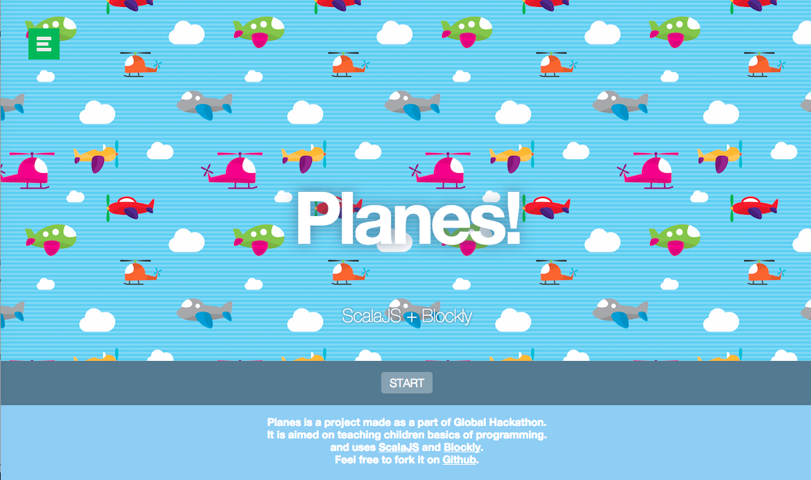
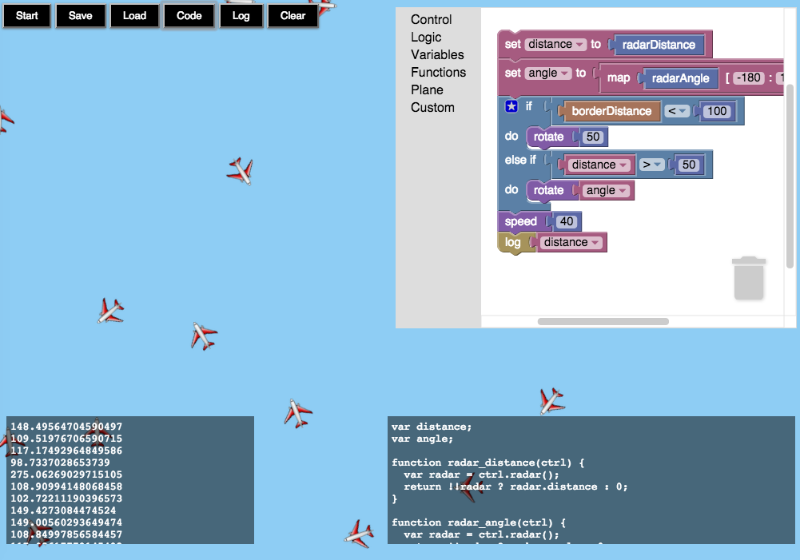

# hack-the-plane

Planes is a project made as a part of Global Hackathon. It is aimed on teaching children basics of programming. and uses [ScalaJS](http://www.scala-js.org) and [Blockly](https://developers.google.com/blockly).

Use SBT to compile project
```
> sbt fastOptJS
> sbt fullOptJS
```
And open index.html from project root. Enjoy!

## Screenshots




